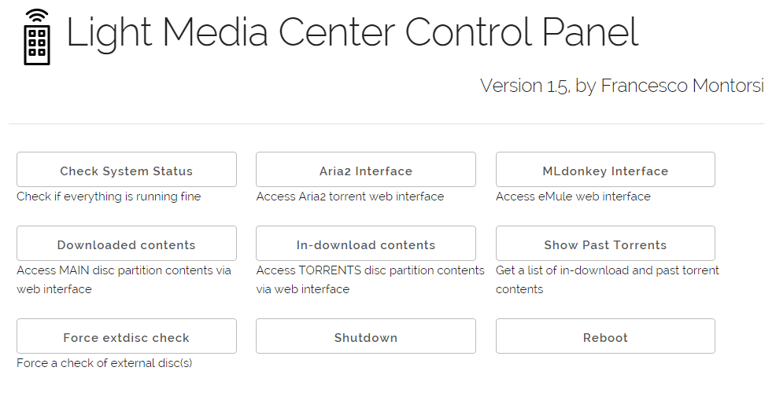

# Light Media Center #

A simple, light and fast collection of scripts, configuration files and web code to implement a basic media center capable to run on single board computers like  <a href="http://beagleboard.org/bone">BeagleBone</a> and <a href="https://www.raspberrypi.org/">Raspberry PI</a>, <a href="https://www.olimex.com/Products/OLinuXino/A20/A20-OLinuXIno-LIME2/">OLinuxino</a>, etc. 
This project transforms a low-cost single-board computer, like the well-known BeagleBone or Raspberry PI, into a low-cost, low-power home media center that can download contents from both the <a href="https://en.wikipedia.org/wiki/BitTorrent">BitTorrent</a> network and from <a href="https://en.wikipedia.org/wiki/EDonkey_network">eDonkey</a> network and stream them directly on multimedia player devices (like smart TVs or smartphones).
 
Some features of the media center: 

0. Runs a torrent client (<a href="https://aria2.github.io/">Aria2</a>) for downloading .torrent files on an external drive attached to the media center hardware.
0. Runs an eDonkey client (<a href="http://mldonkey.sourceforge.net/">MLdonkey</a>) for downloading files from eDonkey Network or Kademlia network.
0. Has a web interface built around open-source components (h5ai, webui-aria2, yaaw, etc)
0. Responsive web design (thanks to Skeleton template) for use by smartphones/tablets
0. Tested on Beaglebone, Raspberry and OLinuxino

## Screenshots ##




## How to Install ##

See  <a href="docs/INSTALL.md">INSTALL.md</a>.

## Future Directions ##

### WebMin ###
Convert this project to <a href="http://doxfer.webmin.com/Webmin/Module_Development">Webmin modules</a> (unfortunately
this would require me to learn Perl!). A webmin module for Minidlna already exists: http://sourceforge.net/p/minidlnawebmin

### Multiple Hard Disks ###
To handle multiple hard disks in a clean, safe way, a better approach compared to the one used now (i.e., having multiple /media folders to manage) could be to
use the OVERLAYFS (https://git.kernel.org/cgit/linux/kernel/git/torvalds/linux.git/tree/Documentation/filesystems/overlayfs.txt):

```
      mount -t overlay overlay -olowerdir=/media/extdiscMAIN,upperdir=/media/extdiscMAIN2,workdir=/media/extdiscMAIN2/work /media/extdiscMERGED
```
or similar approaches:  http://www.filesystems.org/project-unionfs.html,  http://wrapfs.filesystems.org/

Alternatively, a system like Git Annex (http://git-annex.branchable.com/) may be able to handle contents scattered on several hard disks.

### Disk Usage ###
Add NCDU (https://dev.yorhel.nl/ncdu) utility?
Add philesight (http://zevv.nl/play/code/philesight/) utility?

### Support for Remote hard drives ###
Several new routers/modems allow for attaching network-shared storage disks.
E.g. TPLINK W8970 modem activates an FTP server on a specific IP address.


## Similar Projects ##

- http://joerpi.blogspot.it/2013/05/raspberry-pi-bit-torrentdlnasamba_19.html 